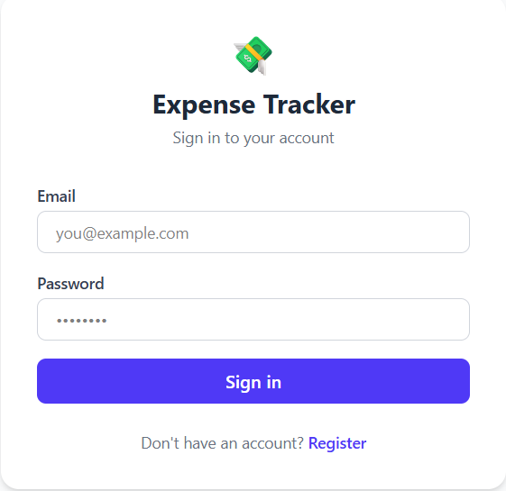
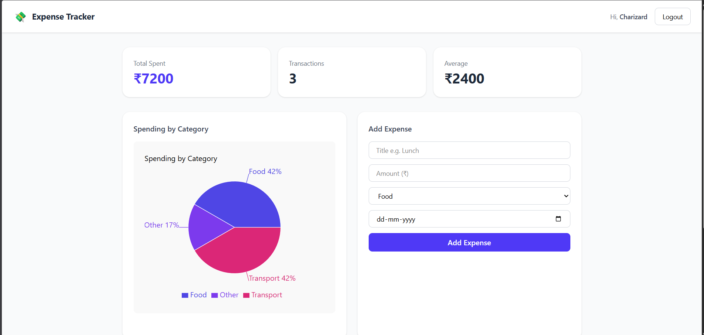
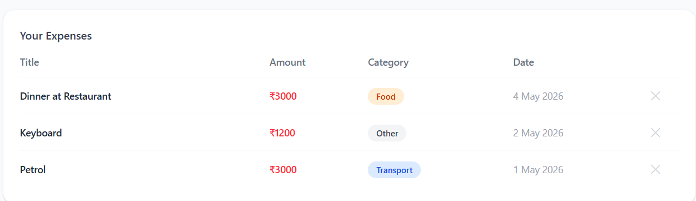

# 💸 Expense Tracker

A full-stack expense tracking web application built with the MERN stack. Users can register, log in, add and delete expenses, and visualize their spending by category with an interactive pie chart.

🔗 **Live Demo:** [expense-tracker-gamma-eight-21.vercel.app](https://expense-tracker-gamma-eight-21.vercel.app)

---

## 📸 Screenshots


| Login | Dashboard | Dashboard 2 |
|-------|-----------|-------------|
|  |  |  |

---

## ✨ Features

- 🔐 User authentication with JWT (register, login, logout)
- ➕ Add expenses with title, amount, category, and date
- 🗑️ Delete expenses
- 📊 Interactive pie chart showing spending by category (Recharts)
- 💰 Summary cards showing total spent, number of transactions, and average
- 🔒 Protected routes — only logged-in users can access the dashboard
- 📱 Responsive design with Tailwind CSS

---

## 🛠️ Tech Stack

**Frontend:**
- React (Vite)
- React Router DOM
- Axios
- Recharts
- Tailwind CSS

**Backend:**
- Node.js
- Express.js
- MongoDB + Mongoose
- JSON Web Tokens (JWT)
- bcryptjs

**Deployment:**
- Frontend → Vercel
- Backend → Render
- Database → MongoDB Atlas

---

## 🚀 Running Locally

### Prerequisites
- Node.js installed
- MongoDB Atlas account (free tier)

### 1. Clone the repository
```bash
git clone https://github.com/rawnaq-code/expense-tracker.git
cd expense-tracker
```

### 2. Set up the backend
```bash
cd backend
npm install
```

Create a `.env` file inside the `backend` folder:
```
MONGO_URI=your_mongodb_connection_string
JWT_SECRET=your_jwt_secret_here
PORT=5000
```

Start the backend:
```bash
npm run dev
```

### 3. Set up the frontend
```bash
cd ../frontend
npm install
```

Create a `.env` file inside the `frontend` folder:
```
VITE_API_URL=http://localhost:5000/api
```

Start the frontend:
```bash
npm run dev
```

### 4. Open the app
Visit `http://localhost:5173` in your browser.

---

## 📁 Project Structure

```
expense-tracker/
├── backend/
│   ├── config/
│   │   └── db.js
│   ├── middleware/
│   │   └── auth.js
│   ├── models/
│   │   ├── User.js
│   │   └── Expense.js
│   ├── routes/
│   │   ├── auth.js
│   │   └── expenses.js
│   └── server.js
└── frontend/
    └── src/
        ├── api/
        │   └── axios.js
        ├── components/
        │   ├── ExpenseChart.jsx
        │   ├── ExpenseForm.jsx
        │   └── ExpenseList.jsx
        ├── pages/
        │   ├── Login.jsx
        │   ├── Register.jsx
        │   └── Dashboard.jsx
        └── App.jsx
```

---

## 🧠 What I Learned

This was my first full-stack MERN project, built during my summer break as a 2nd year CSE student. Key things I learned:

- How **JWT authentication** works end-to-end — hashing passwords with bcrypt, signing tokens, and protecting routes with middleware
- How to model data with **Mongoose schemas** and connect a Node.js app to MongoDB Atlas
- How to build **interactive charts** with Recharts and transform raw expense data into grouped category summaries
- How to connect a React frontend to an Express backend using Axios with auth interceptors
- How to deploy a full-stack app with separate frontend (Vercel) and backend (Render) deployments

---

## 👨‍💻 Author

**Mohd Rawnaq Qureshi**
- B.Tech CSE Student, Hyderabad, India
- GitHub: [@rawnaq-code](https://github.com/rawnaq-code)

---

## 📄 License

This project is open source and available under the [MIT License](LICENSE).
